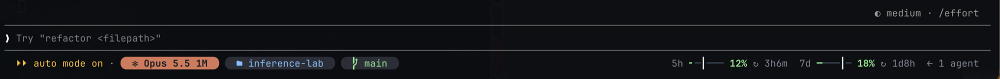
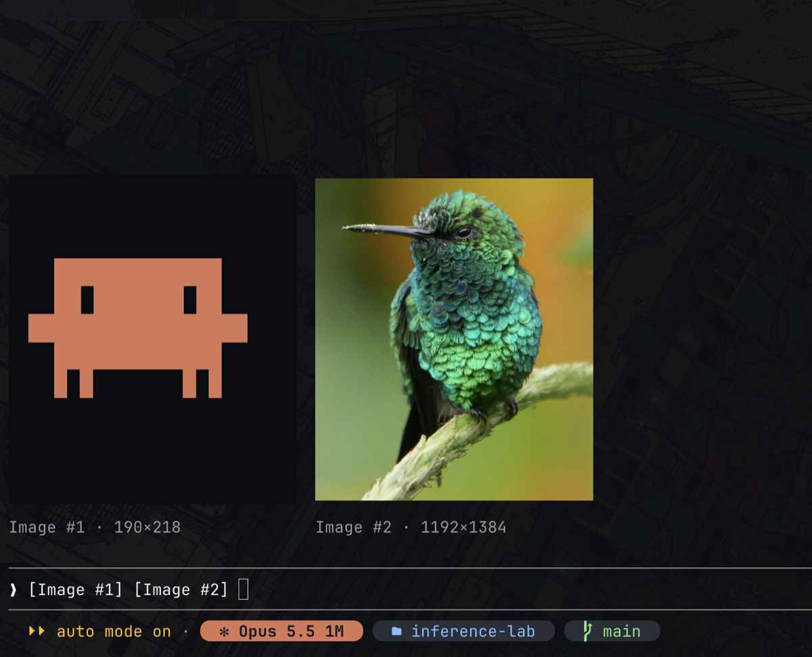
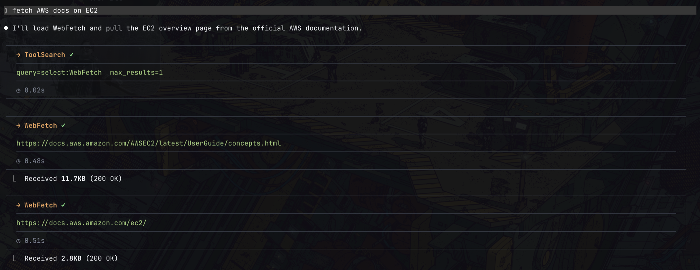
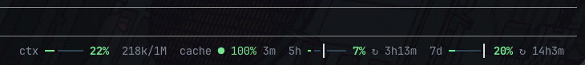
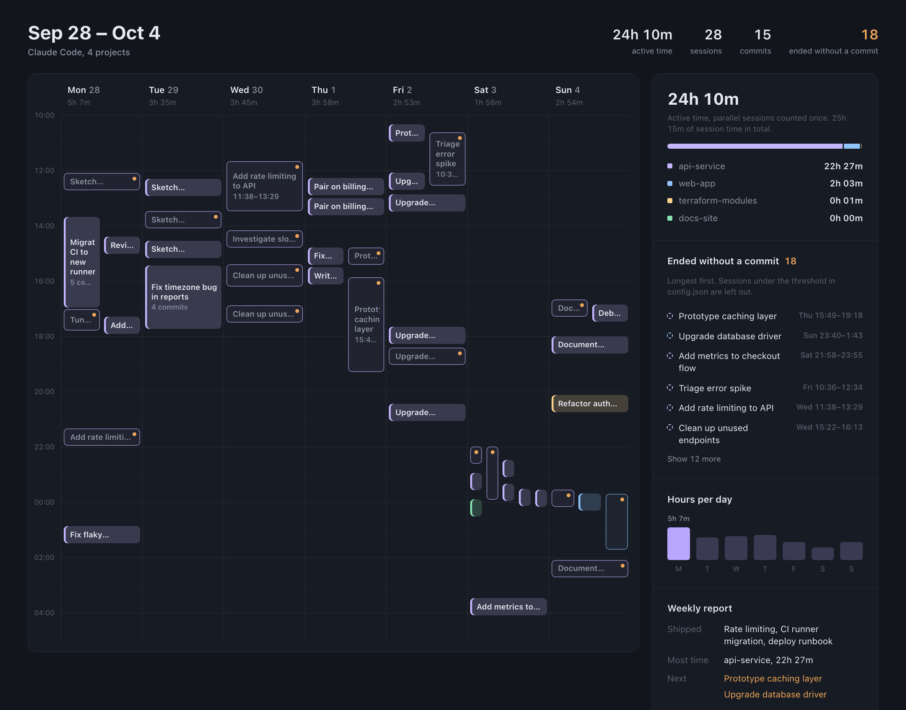
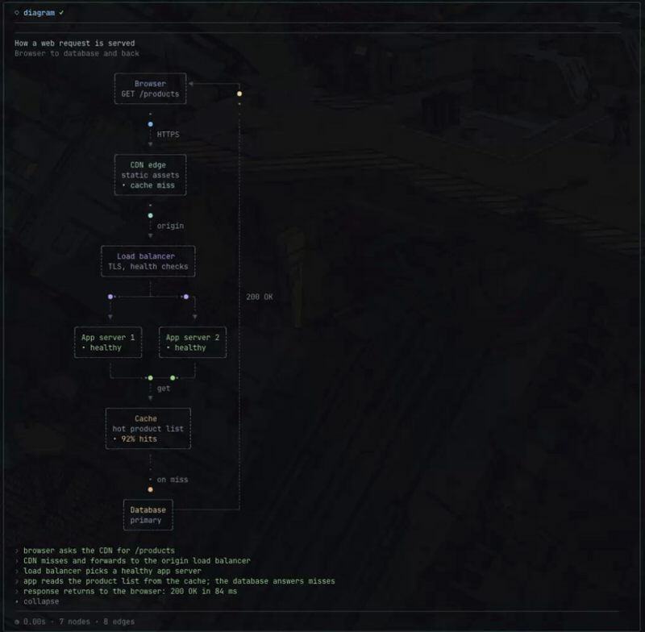

# my-claude-code-mods

Six mods for [Claude Code](https://code.claude.com): a one-line status bar, image previews for pasted
screenshots, boxed cards for tool calls, a keepalive for the prompt cache, a weekly calendar of your
sessions, and animated diagrams Claude can draw in the transcript.

Mods are Claude Code plugins built from function hooks. They need **Claude Code 2.1.287 or newer**. Mods
are an early-access feature: the hooks API can change between releases.

| Mod | What it does |
|---|---|
| [`slick-bar`](#slick-bar) | Replaces the hint line under the prompt with a one-line bar: model, effort, folder, branch, context gauge, prompt-cache health, rate-limit gauges |
| [`image-peek`](#image-peek) | Shows a preview of a pasted image above the prompt and under the message that sent it |
| [`tool-cards`](#tool-cards) | Draws each tool call as a boxed card: highlighted command, output preview, timing footer |
| [`cache-warm`](#cache-warm) | Keeps the prompt cache of an idle chat warm with a small capped ping, and counts cache hits and misses |
| [`week-calendar`](#week-calendar) | `/week` draws a calendar of the week's sessions with commits, hours per project, and a 3-line report |
| [`diagram-mod`](#diagram-mod) | Gives Claude a `show_diagram` tool: animated box-and-arrow diagrams, with packets moving along the edges |

## Install

1. Clone the repo:

   ```sh
   git clone https://github.com/mustafa89/my-claude-code-mods.git ~/.claude/mods
   ```

2. Tell Claude Code to load the mods. Add this to the `env` block of `~/.claude/settings.json`
   (paths separated by `:`; `~` is allowed):

   ```json
   {
     "env": {
       "CLAUDE_CODE_PLUGIN_DIRS": "~/.claude/mods/slick-bar:~/.claude/mods/image-peek:~/.claude/mods/tool-cards:~/.claude/mods/cache-warm:~/.claude/mods/week-calendar:~/.claude/mods/diagram-mod"
     }
   }
   ```

   Leave out the mods you do not want. slick-bar lists cache-warm as a dependency for its cache segment,
   so load the two together.

3. Start a new Claude Code session. Each mod prints `<name>: loaded` in the transcript.

To try one mod for a single session only:

```sh
claude --plugin-dir ~/.claude/mods/slick-bar
```

**If you use a `statusLine` command**, the bar does not replace it. The bar sits on the hint line under
the prompt; your status line stays below it. Remove `statusLine` from your settings if you want only the bar.

## slick-bar



One line under the prompt, after Claude Code's own permission-mode label:

- **Model and effort**: `✻ Opus 5.5 1M · medium`. The `✻` turns into `◉` while a turn runs.
- **Folder and branch**: repository name (plus subfolder), branch, `±` when the tree has changes, `↑`/`↓`
  for commits ahead of or behind the upstream.
- **Context gauge**: how full the context window is, green → amber → red.
- **Rate-limit gauges** (subscription plans): 5-hour and 7-day usage, the time until each window resets
  (`↻ 3h12m`), and a `┃` tick that marks how much of the window has passed. Usage to the right of the tick
  means you are using it faster than the window allows; the percentage turns amber when the current pace
  projects past 100%.
- **Prompt cache** (with [cache-warm](#cache-warm)): `cache ● 97% 52m ✗1 ⟳2`. The dot is green while the
  cache is warm, amber in the last minutes before it expires, and `○ cold` after. Then the share of the last
  request served from cache, the time until the cache expires, misses (`✗`) and keepalive pings (`⟳`).

When the terminal is narrow, segments drop in this order: hint text, 7-day gauge, token count, cache,
branch, folder. The model and the context gauge always stay.

The bar needs a [Nerd Font](https://www.nerdfonts.com) for the pill shapes and icons.

## image-peek



- While you write a prompt, every pasted image shows above the prompt with its size (`Image #3 · 1246×846`).
- After you send it, the image shows under your message in the transcript.

image-peek draws real images through the
[kitty graphics protocol](https://sw.kovidgoyal.net/kitty/graphics-protocol/), so it needs a terminal that
supports it, such as kitty or Ghostty. Elsewhere it shows the image's label instead.

It also needs macOS: it uses `sips` to make a smaller copy of each image.

**Terminal multiplexers**: inside a multiplexer that passes kitty graphics through but identifies itself
differently (for example herdr, which reports `libghostty`), Claude Code turns graphics off. To turn them on,
add this to the same `env` block:

```json
"CLAUDE_CODE_FORCE_TERMINAL_IMAGES": "1"
```

Only do this if your terminal really supports kitty graphics. Otherwise images draw as empty boxes.

## tool-cards



Every tool call becomes a card:

- **Header**: tool name and status: `✓` done, `◌` running, `✗` error, `⊘` interrupted. The command's
  description follows.
- **Bash**: the command with syntax colours, then the first 5 lines of output (errors in red).
- **Edit and Write**: a split diff, old on the left and new on the right, with line numbers, red and green
  rows, and the changed words highlighted. A `+N -M` header with a bar shows the size of the change. Narrow
  terminals stack old over new. A new file from Write keeps Claude Code's own view.
- **MCP tools**: the arguments, then the output folded behind `▾ output · N lines`. JSON is indented;
  errors show in red.
- **Other tools**: one line saying what the call acted on, for example `src/cart/total.js:10-30` for a Read.
- **Footer**: how long the call took, how many words it printed, and the Bash timeout if one was set.
- **Diagrams** from [diagram-mod](#diagram-mod): a rounded card headed `◇ diagram`, as wide as the diagram,
  with the animation inside and `▴ collapse` / `▾ expand`.

Claude Code normally folds runs of reads and searches into one line (`Searched for 2 patterns`).
tool-cards unfolds them, so each call gets its own card.

### Expanding output

- Click `▾ expand` on a card to see all of its output or diff (up to 400 lines). Clicks reach the card in
  fullscreen mode.
- `/cards full` expands every card; `/cards compact` goes back to the preview (5 output lines, 16 diff rows, MCP output folded); `/cards` switches
  between the two.

`Ctrl+o` does not expand a card. Claude Code does not tell mods when the `Ctrl+o` view is open.

## cache-warm



Claude Code caches the conversation on the API side. A request that reads the cache pays a small part of the
input price; a request after the cache expired writes the whole conversation again. cache-warm sends one
small request just before the cache expires, so an idle chat stays warm.

### How it works

- **Timer**: a 15-second timer runs inside the Claude Code session. There is no cron job; the timer stops
  when the session closes or the computer sleeps.
- **Ping**: when the chat is idle and the cache is 2 minutes from expiry, the mod calls `$.model.fork`. The
  fork sends the session's last request again with a one-line prompt. The API reads the conversation from the
  cache, and that read starts the cache lifetime again. The fork runs no tools and does not show in the
  transcript.
- **Hits and misses**: after each turn, the mod reads the token counts of the turn's first request. If less
  than half of the input came from the cache, the turn counts as a miss.

### Why it is worth it

[Prompt caching prices](https://platform.claude.com/docs/en/build-with-claude/prompt-caching), as a
multiple of the normal input price:

| Request | Price |
|---|---|
| Cache write, 1-hour cache | 2× |
| Cache write, 5-minute cache | 1.25× |
| Cache read | 0.1× (Opus 5.5: 0.05×, Fable 5.1: 0.025×) |

Example: a 400k-token chat on Opus 5.5 with the 1-hour cache.

- **The cache expires**: your next prompt writes 400k tokens at 2×, the cost of **800k** input tokens.
- **The cache is warm**: your next prompt reads 400k tokens at 0.05×, the cost of **20k** input tokens.
- **One ping**: the same read, **20k**.

A ping costs 1/40 of a cold restart. Four pings cost 80k, one tenth of a restart, even if you never come back
to the chat. The keepalive pays for itself when there is a better than 1-in-40 chance that you come back within
the next hour. At the general read price of 0.1×, the break-even is 20 pings.

### Limits on the pings

- **Cap**: at most `maxPings` pings (default 4) per idle stretch. A prompt you type resets the count.
- **Rate limit**: no pings while the 5-hour usage window is 80% full or more.
- **Expired cache**: no ping after the cache expired, for example after the computer slept. A ping then would
  pay a full cache write.
- **Missed ping**: when a ping does not read from the cache, the mod stops pinging until your next turn.
- **Failed ping**: an API error does not count as a refresh. The next tick tries again.

### Settings and command

| Setting | Values | Default |
|---|---|---|
| `ttl` | `1h`, `5m` | `1h` |
| `maxPings` | a number | `4` |

Change them in `/config`. Claude Code sessions use the 1-hour cache on most plans. Use `5m` for the API
default, or when your account runs in usage overage.

`/cache-warm status` shows the cache state, `/cache-warm off` stops the pings, `/cache-warm on` starts them
again.

## week-calendar



*The screenshot shows a real week with every title, project and commit replaced.*

`/week` builds a calendar of this week's Claude Code and Codex sessions, opens it in your browser, and prints
a 3-line report:

```
Shipped: rate limiting, CI runner migration, deploy runbook
Most time: api-service, 22h 27m
Next: Prototype caching layer, Upgrade database driver
```

`/week last` shows last week; `/week -2` goes two weeks back.

### What the calendar shows

- **Sessions as blocks**, one colour per project. A session splits into blocks at gaps longer than 30 minutes.
- **Commits** you made during each block, matched by your `git config user.email`.
- **Sessions that ended without a commit**: a dashed outline and an amber dot. The sidebar lists them,
  longest first.
- **Active time**: hours per project and per day. Sessions that run in parallel count once.
- **Details**: click a block to see its time, model, commits, and the first message you typed.

### How it works

- `bin/build.mjs` reads `~/.claude/projects/**/*.jsonl` and `~/.codex/sessions/**/*.jsonl`, runs `git log`
  in each project, and writes one HTML file to `~/.calendar/week-<monday>.html`. Node only, no network.
- The hook sends the week's commit subjects to Sonnet once to write the "Shipped" line.
- The HTML file holds all its data inline and loads nothing from the network.

The calendar file holds the first message of each session as plain text. It stays on your machine.

### Settings

`~/.calendar/config.json` is created on the first run:

| Setting | Default | What it does |
|---|---|---|
| `dayStartHour` | `6` | Work before this hour counts toward the previous day |
| `gapMinutes` | `30` | A gap longer than this starts a new block |
| `minNoCommitMinutes` | `15` | Shorter blocks are not flagged as ending without a commit |
| `weekStart` | `mon` | `mon` or `sun` |
| `theme` | `dark` | `dark` or `light` |
| `accent`, `palette` | | Colours for today, the busiest day, and the projects |

It needs Node and git. It opens the file with `open` on macOS or `xdg-open` on Linux.

## diagram-mod



Ask Claude for a diagram or a visual explanation and it calls the mod's `show_diagram` tool. The diagram
draws in the tool's row in the transcript:

- **Boxes**: a label, up to 4 detail lines and a status line, with dashed borders and a colour per role.
- **Edges**: dashed arrows with optional labels. The layout runs top to bottom and is computed from the
  edges; Claude never gives coordinates. Edges that point back up run along the right margin.
- **Packets**: coloured dots with a fading trail loop along the edges you name, each at its own speed.
- **Log**: lines under the diagram type out one by one.

The bundled skill tells Claude when to use the tool and how to keep a diagram readable: one idea, about
12 nodes at most, labels of 1-3 words.

### How it animates

- About 30 frames a second, repainting one cell grid in place.
- Only the newest diagram moves; older ones keep a still frame.
- The animation waits while Claude is still writing its reply, so the streaming text stays fast, and
  pauses while the row is scrolled out of view.
- A terminal narrower than the diagram gets a still text version instead.

### Settings

| Setting | Default | What it does |
|---|---|---|
| `display` | `inline` | `inline`: the diagram animates in the transcript row. `pane`: it opens in a side pane, closed with `q` or `Esc` (Claude Code only seats a pane it did not ask for from 144 columns) |

`examples/dispatcher.json` is a sample spec you can paste into a prompt.

## Development

Each mod is a folder:

```
<mod>/
  .claude-plugin/plugin.json   name, version, description, types
  hooks/hooks.json             { "modules": ["./register.tsx"] }
  hooks/register.tsx           the hooks
  types/index.d.ts             the state the mod keeps
  tests/*.test.tsx             tests
```

Check and test a mod:

```sh
claude plugin validate ./slick-bar
claude plugin test ./slick-bar
```

Claude Code writes the API types into `<mod>/.claude-plugin/types/` the first time it loads a mod; those
files are not committed. A session started with `--plugin-dir` reloads a mod when you save its files.

## Limits

These come from the mods API, not from the mods:

- **Permission mode**: mods cannot read it, so the bar sits after Claude Code's own mode label.
- **Space above the prompt**: the empty row between the transcript and the prompt belongs to Claude Code.
- **`Ctrl+o`**: tool rows do not report the expanded view (see [Expanding output](#expanding-output)).
- **Cache lifetime**: mods cannot read which cache lifetime the session uses, so cache-warm takes it from
  the `ttl` setting.
- **Tool names**: Claude Code lists a tool a mod registers as `mcp__<mod>__<tool>`, so diagram-mod's tool is
  `mcp__diagram-mod__show_diagram` though no MCP server is involved.

## License

[MIT](LICENSE)
